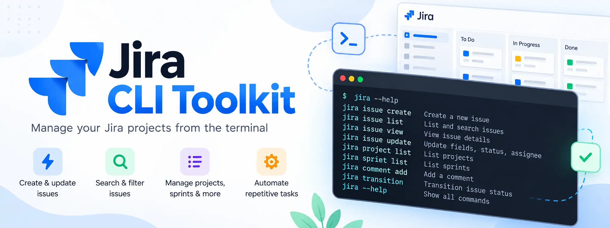

<a href="https://user17745.github.io/jira-cli-toolkit/"></a>

<p align="center">
  <a href="https://github.com/User17745/jira-cli-toolkit/releases/latest"></a>
  <a href="https://github.com/User17745/jira-cli-toolkit/actions/workflows/ci.yml"></a>
  <a href="https://github.com/User17745/jira-cli-toolkit/actions/workflows/release.yml"></a>
  
  
  <a href="https://github.com/User17745/jira-cli-toolkit/releases"></a>
</p>

# Your Jira. At your command.

**`jira` brings Jira Cloud into your terminal.** Find issues, create and edit work, manage sprints, and automate repeatable workflows using your existing account and project permissions.

[Website](https://user17745.github.io/jira-cli-toolkit/) · [Command reference](docs/usage.md) · [Latest release](https://github.com/User17745/jira-cli-toolkit/releases/latest) · [Migration guides](docs/migration/upgrade-to-v2.md)

## Get started

Install the latest stable native binary. The installers verify release checksums and run version/help checks before installing. No Python runtime, administrator access, or Jira credentials are needed for native installation.

### macOS

```bash
curl -fsSL https://raw.githubusercontent.com/User17745/jira-cli-toolkit/main/scripts/install.sh | bash
export PATH="$HOME/.local/bin:$PATH"
```

macOS **15+**, Apple Silicon or Intel. Installs to `~/.local/bin/jira`.

### Linux

```bash
curl -fsSL https://raw.githubusercontent.com/User17745/jira-cli-toolkit/main/scripts/install.sh | bash
export PATH="$HOME/.local/bin:$PATH"
```

Linux **x86_64, glibc 2.39+** (for example Ubuntu 24.04+). Installs to `~/.local/bin/jira`. `curl` and `sha256sum` or `shasum` are required. On older systems, musl or unsupported native architectures, use the verified Python wheel instead.

### Windows

Run in PowerShell:

```powershell
irm https://raw.githubusercontent.com/User17745/jira-cli-toolkit/main/scripts/install.ps1 | iex
```

Windows **10+ x86_64**, PowerShell **5.1+**. Installs to `%LOCALAPPDATA%\JiraCLI\bin\jira.exe` and adds that directory to your user PATH. Open a new terminal if needed.

**Prefer manual installation?** [Open the latest release](https://github.com/User17745/jira-cli-toolkit/releases/latest) and choose a matching binary or Python wheel. The [installation guide](docs/migration/upgrade-to-v2.md) explains verification and pipx/uv/Python installation. The Python distribution remains `jsup` and is not published to PyPI.

**Already installed?** Use [the migration guide](docs/migration/upgrade-to-v2.md). Installers refuse to replace existing CLI commands or managed shims. Custom paths and pinned versions are documented in [installer options](docs/install.md).

### Connect your account

```bash
jira --version
jira auth login --profile work
jira context use --project ENG
jira issue list --open
```

Replace `ENG` with your project key. Guided login explains how to [create an Atlassian API token](https://id.atlassian.com/manage-profile/security/api-tokens), hides token input, validates your identity, and helps you select a project.

## Everyday workflows

| Do this | Run this |
| --- | --- |
| Find unfinished work | `jira issue list -p ENG --open` |
| Run your own JQL | `jira issue list --jql 'assignee = currentUser()'` |
| Inspect an issue | `jira issue view ENG-42` |
| Create an issue | `jira issue create -p ENG --type Bug --summary "Fix login"` |
| Edit an issue | `jira issue edit ENG-42 --summary "Fix keyboard navigation"` |
| Discover transitions | `jira issue transitions ENG-42` |
| Change its state | `jira issue transition ENG-42 --to "In Progress"` |
| Add a comment | `jira issue comment add ENG-42 -m "Review started"` |
| List boards and sprints | `jira board list -p ENG` · `jira sprint list --board 123` |
| Inspect project fields | `jira project fields -p ENG --type Bug` |

Issue types, fields, transitions and board operations follow your project’s metadata and permissions. The CLI also supports assignment, relationships, attachments, comment maintenance, components, templates, CSV and shell completion. [Explore the full reference](docs/usage.md).

Help works without credentials or a network connection:

```bash
jira --help
jira help issue create
jira issue comment --help
```

## Authentication and profiles

- **Native credentials:** tokens use macOS Keychain, Windows Credential Manager, or a supported Linux wallet. Preferences at `~/.config/jsup/config.json` hold profile references, not tokens.
- **Multiple contexts:** use `profile list/use`, `--profile NAME`, and `context use --project KEY` to choose an account and project.
- **Scoped tokens:** guided login supports `--scoped` and cloud-ID discovery. Tokens inherit account permissions and must have the scopes needed for each operation.
- **Explicit alternatives:** scripts can supply a complete environment identity. POSIX `--storage file` is a separate mode-0600 plaintext opt-in, never an automatic fallback.
- **Recovery:** API tokens cannot refresh automatically. Replace an invalid/revoked/expired token with `auth login`; the CLI never replays a write automatically after recovery.

Native stores can require interactive approval. Linux wallets are interactive-only; scripted macOS access suppresses approval dialogs and fails with recovery instructions if approval is needed. [Read the authentication details](docs/usage.md#guided-authentication-and-profiles).

## Automation and agents

```bash
jira issue list -p ENG --open --json --no-input
jira issue list -p ENG --open --csv --columns key,summary,status
jira issue create --template callback --var name=Example --var issue="Login failed"
jira completion zsh
```

JSON preserves API field structures, CSV supports selected columns, and `--no-input` makes missing input explicit. Destructive commands still need `--yes` in scripts. Runtime errors are structured on stdout for grouped commands; diagnostics and usage errors use stderr. Exit codes: **0** success/help, **1** API/network failure, **2** input/config/file errors, **130** interruption.

Templates are declarative JSON with declared variables, not executable hooks. The example callback template has explicit defaults that must fit your project; ordinary creation adds no support-specific fields. [Read scripting and template details](docs/usage.md).

Generic authenticated `jira api` requests and `--spec` discovery are **planned for v2.5**, not available in v2.1. [Follow the checkboxed roadmap](docs/sprints/v2.5-api/roadmap.md).

## Explicit updates and releases

```bash
jira update --info
jira update --check
jira update --yes
```

Standalone updates select a compatible GitHub Release binary, verify its manifest/hash/size, validate version/help, and retain a `.previous` backup. Windows completes replacement through a separate helper. Config and credentials stay untouched; ordinary commands never auto-update.

For pipx/uv/Python installations, `update` gives instructions for the owning manager. Public downloads need no Jira token; an optional GitHub token can increase API rate limits. [Update, verification and rollback details](docs/migration/upgrade-to-v2.md).

Releases contain wheel/sdist, macOS arm64/x86_64, Linux x86_64 and Windows x86_64 binaries, manifest and checksums. Current native OS requirements are listed above and in the manifest. Independent attestation verification, signing and notarization remain [release-hardening work](docs/sprints/v2-upgrade/roadmap.md#remaining-work-after-v21).

## Migrating from old commands

`jira` is the primary command from v2.1. Python-package installations retain **`jsup` and `jira-cli-toolkit` throughout v2.x**. Invoking either prints a startup notice on stderr; JSON stdout and internal completion/update protocols stay intact. Native installers supply the `jira` executable.

| Earlier command | Current command |
| --- | --- |
| `jsup open -p ENG` | `jira issue list -p ENG --open` |
| `jsup issue-show ENG-42` | `jira issue view ENG-42` |
| `jsup issue-move ENG-42 --to Done` | `jira issue transition ENG-42 --to Done` |

Read the [installation/credential migration guide](docs/migration/upgrade-to-v2.md) and the [complete developer command migration](docs/migration/legacy-commands.md). Existing migrated profiles need no second credential migration when updating from v2.0.

## Development

```bash
python -m venv .venv
.venv/bin/python -m pip install -e .
.venv/bin/python -m unittest discover -s tests -v
```

On Windows use `.venv\Scripts\python`. Tests use local fixtures and mocked Jira calls; they do not need credentials or change issues.

The landing page uses React, TypeScript, Vite, Tailwind and shadcn/ui:

```bash
cd web
npm ci
npm run dev
npm run build
npm test
```

[Website development and browser checks](web/README.md) · [Installer development](docs/install.md) · [Release acceptance](docs/sprints/v2-upgrade/acceptance.md)

## Scope and next steps

The current release supports standard **Jira Cloud** issues and applicable Software boards/sprints. Data Center and Service Management customer-request APIs remain future work. Required-field discovery cannot describe every app-specific workflow validator; Jira remains authoritative.

The repository is public. A project license is still to be selected; public visibility alone is not an open-source license. [See completed milestones and remaining work](docs/sprints/v2-upgrade/roadmap.md).
